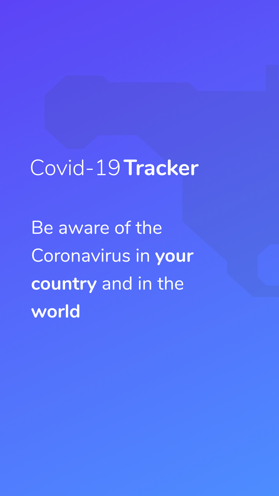
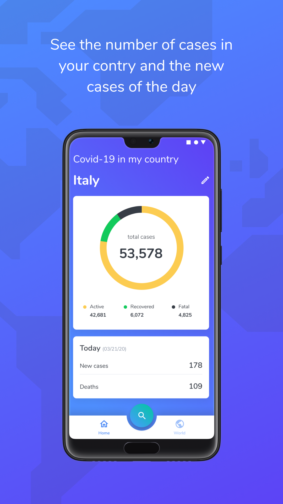
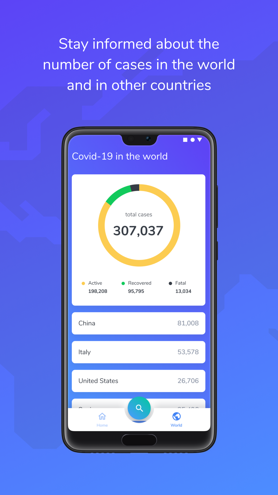
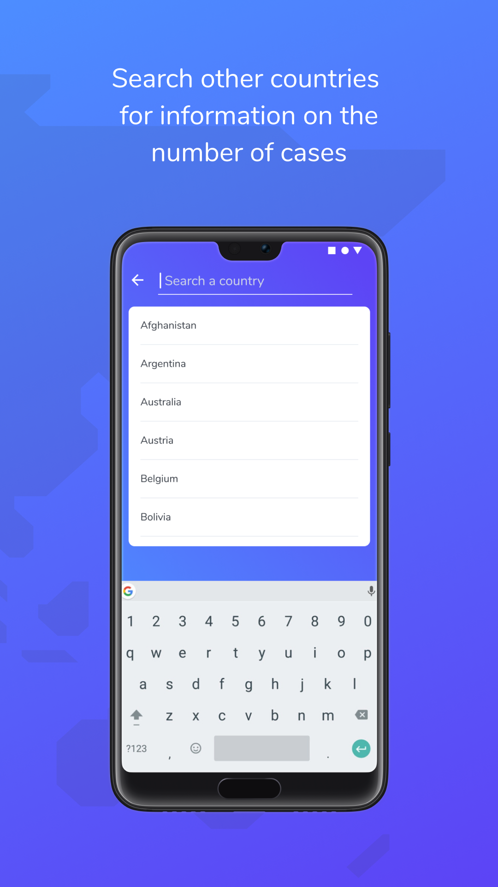

# Covid 19 - Android

     
     
     
     

## Description

With Covid-19 Tracker you'll be aware of the pandemic situation in real time. See the number of
infected and cured, in your country and in the rest of the world.

## Product feature
- Your country's cases
- World's cases
- Global Search for cases

## 3rd party libraries used
- [Koin](https://github.com/InsertKoinIO/koin)
- [Retrofit](https://github.com/square/retrofit)
- [Rx Java](https://github.com/ReactiveX/RxJava)
- [Rx Java Android](https://github.com/ReactiveX/RxAndroid)
- [Rx Java Retrofit Adapter](https://github.com/akarnokd/RxJavaRetrofitAdapter)
- [Covid API](https://github.com/javieraviles/covidAPI)

## Credits
- [@obrunovieira - Android Developer](https://www.linkedin.com/in/obrunovieira/)
- [@brabsblue - Designer](https://www.linkedin.com/in/barbara-schoen/)
- [Novel Covid - Open Source API](https://github.com/NovelCOVID/API)

## Sources
- [Worldometers](https://www.worldometers.info/coronavirus/)
- [Novel Coronavirus - World Health Organization](https://www.who.int/emergencies/diseases/novel-coronavirus-2019/situation-reports/)
- [CDC - Centers for Disease Control and Prevention](https://www.cdc.gov/coronavirus/2019-ncov/cases-updates/)

## Suggestions and Feedback? Please, contact us
bee.duplo@gmail.com
